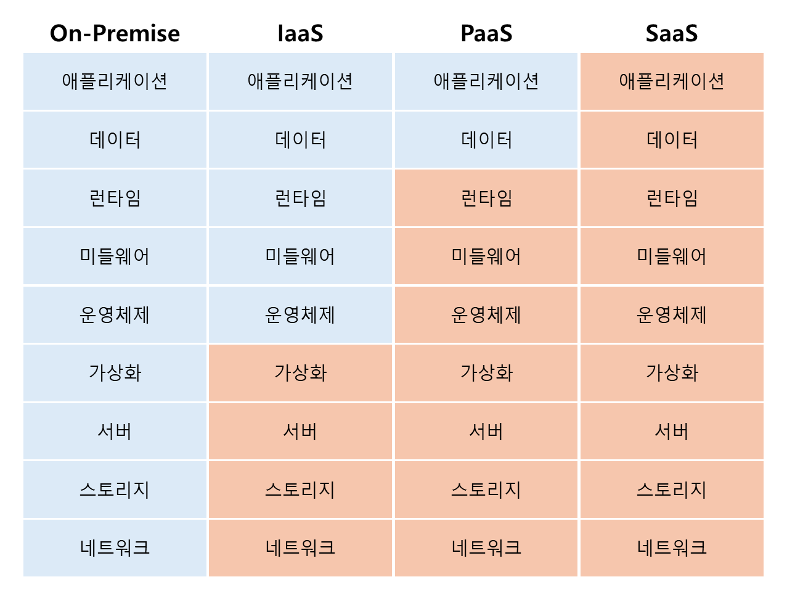

## as-a-Service

### as-a-Service란?
- 사용자가 인터넷 기반으로 서비스를 사용할 수 있도록 제공하는 비즈니스 모델
- `서비스형 OO` 정도로 번역된다.

### as-a-Service 종류

**IaaS(Infra-as-a-Service, 서비스형 인프라)**
- 클라우드 컴퓨터, 스토리지 등 컴퓨팅 자원(인프라)을 제공하는 서비스
- 사용자가 컴퓨팅 자원인 CPU, memory, 운영체제 등을 선택, 관리할 수 있도록 기능을 제공
- 예시 : AWS, GCP, Azure, 네이버클라우드 등

**Paas(Platform-as-a-Service, 서비스형 플랫폼)**
- 개발 환경, 배포, 실행 등 응용 프로그램 개발에 필요한 자원(플랫폼)을 제공하는 서비스
- 사용자가 자신만의 개발 환경을 선택하고, 만든 응용 프로그램을 배포, 실행 등을 할 수 있도록 기능을 제공
- 예시 : Google Colab, Firebase, Supabase, 구름IDE 등

**Saas(Software-as-a-Service, 서비스형 소프트웨어)**
- 응용 프로그램을 클라우드에 구축하고, 사용자에겐 인터넷을 통해 소프트웨어를 제공하는 서비스
- 사용자가 개발하지 않아도 응용 프로그램을 웹 브라우저 등을 통해 사용할 수 있도록 기능을 제공
- 예시 : Notion, MS Office 365, Google Drive 등

### as-a-Service 비교
> 주황 : 서비스 제공 영역
> 파랑 : 사용자의 관리 영역

### 참고사이트
- [openmaru] IaaS, PaaS, SaaS – as a Service의 개념과 역할 [(🔗)](https://www.openmaru.io/%EC%84%9C%EB%B9%84%EC%8A%A4-%EA%B0%9C%EB%85%90-%EC%97%AD%ED%95%A0/)
- [동아일보] SaaS, IaaS, PaaS··· 'as a Service'가 붙은 용어들은 무슨 뜻일까? [(🔗)](https://www.donga.com/news/It/article/all/20230816/120729634/1)